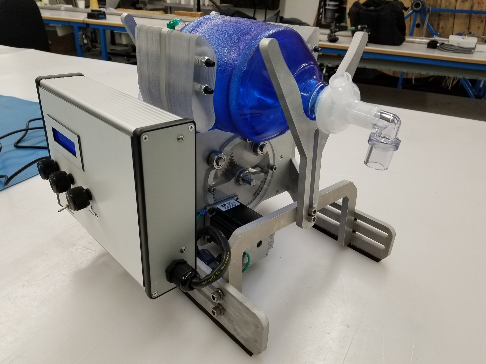
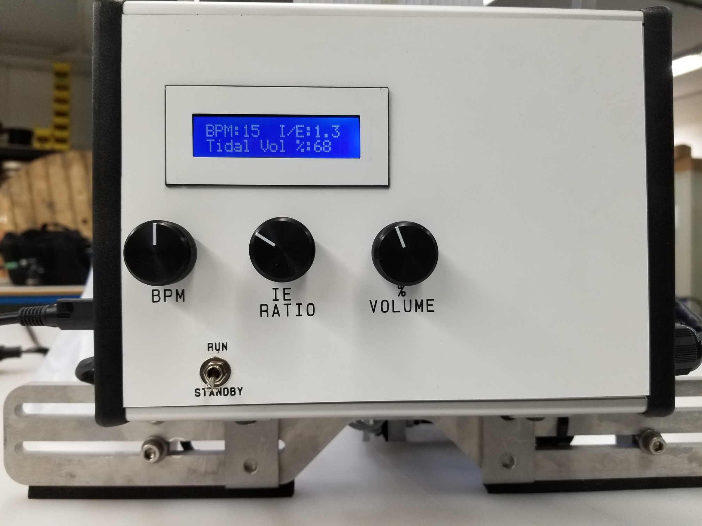

# DISCLAIMER
This is an **INVESTIGATIONAL MEDICAL DEVICE** being evaluated for use
in hospital setting during **extreme crisis** leading to ventilator
shortages.

It has **not been approved** by any regulatory body.

It has significant potential for causing harm  even in the hands of
skilled and experienced clinicians. Any clinical application requires close
monitoring.

It is posted here in order to facilitate rapid knowledge sharing and research
on strategies for addressing the global ventilator shortage during pandemics.

Any of use of this device is done purely at your own risk and liability. The
developers and associated institutions do not accept any liability for its use.

# BVM-HALO-Ventilator 2.1 Prototype Design Notes

## Control Architecture

### Microprocessor
An Arduino Uno was selected as the microprocessor controller primarily because of it’s abundant supply, ease of use and robustness. 

### Code
Custom code was written initially by UofT, rewritten by Promation and finally reviewed, revised and tested by Alithya (Matthew Humeny  - Matthew.Humeny@alithya.com). Note that there are some anomalies with the code that should be addressed in future revisions:

a) The limit switches were inadvertently soldered in at NC instead of NO. This was corrected using software. This should be reinstated as initially designed.

b) The rotation of the pots was reverse to correct the reverse electrical connection on the PCB. This should be correct on the PCB and the software

c) A 2nd order correction was added to the IE ratio to offset errors introduced due to the stepper losing steps at very high speeds. This needs to be fixed with hardware and software so that steps are not lost. Then the code can be reverted back as before

d) The plateau pause was reduced from 150mS to 50mS because it seemed the delay was longer than the software was set at, and it was not possible to measure the delay with the FluxMed. The plateau delay needs to be reinstated to 150 mS.

e) Although an alarm was connected, it was not programmed in. Alarming would be good to add.

f) The current code does not allow changing of bags that have a dramatic diameter difference from the Carestream BVM used at TGH. This feature can be easily added. 2 DIP switches (allowing for 4 different, DIP selectable bag diameters)

### Wiring and PCB
Initial wiring was designed and done by Promation using soldered and screw connections. The general electronic design was then incorporated into a custom PCB designed by Laveer Engineering (Jeff Hulcoop -  jhulcoop@laveer.ca). The current board has several fixes required (the 16 pin connector needs to be rotated 180deg., and the standby/run switch needs to be pulled to ground instead of +5V. The three pots are wired backwards [fixed with software))

### Power Supply
The entire unit is power by a Delta medical-grade power supply rated for 24VDC and 90W. This power supply has a robust locking plug which prevents removal without pulling back the plug jacket first (ie. tugging on the power cord will not disconnected it).

### LCD
The display used is a 2x16 LCD, although the device was initial designed for a 4x20 LCD. Subsequent versions should revert back to a 4x20 display which is easier to see and can display more information simultaneously.

### Shielding
Because of EMI generated onto the limit switch wires in Prototype #1, shielded 24AWG wiring was used for the two limit switches, and a shielded braided sleeve was placed over the stepper wires. The shielding for the stepper was grounded at both ends (to the stepper itself and to the control enclosure). A metal enclosure was selected intentionally to reduce noise. A large ferrite was added to the stepper motor wiring, and ferrites and capacitors were added on the PCB to reduce the effect of electrical noise. The stepper wiring and the limit switch wiring were kept apart to limit induced noise onto the limit switch wire.

### Stepper Controller
Electromate (Alex Werner - alex@electromate.com) worked with Applied Motion engineers to select and configure the appropriate industrial grade controller and stepper motor. The controller used is an STR4  (https://www.applied-motion.com/products/stepper-drives/str4). The controller is operating in 200 steps per rotation smooth.

### Stepper Motor
The industrial grade stepper motor is an Applied Motion HT23-601 (https://www.applied-motion.com/products/stepper-motors/ht23-601). It was connected in the bipolar parallel configuration, and the controller motor type was selected as type 8.

### Planetary Inline Gearbox
A 5:1 inline planetary gearbox was installed between the stepper motor and the device drive train to increase the delivered torque to the arms (see GAM PE-N23-005G Inline planetary gearbox ).

### Moisture Resistance
Some efforts were made to minimize the potential ingress of liquids into the enclosure and components. The potentioment shafts were sealed using rubber seals, and the LCD display was sealed with RTV sealant. The enclosure itself is relatively moisture resistant. With prolonged exposure to moisture, it is expected that electrical connections will corrode and this device will cease to operate properly. There is not concern about electrical shock because the device runs entirely on 24VDC, with a power consumption of well below 90W. The power supply itself is sealed and medical grade.

### Safety
This prototype device is guarded on both sides of the drive train with lexan shields, although pinch points do remain on this device. A resuscitator bag should never be installed or removed unless the arms are retracted and in the standby position, or if the power is physically disconnected from the device.

### Rebooting
In the unlikely case that the controller locks up, unplug the power supply from the device, and reconnect it. This will reset he microcontroller.

## Mechanical Design
The initial design was based on the MIT E-vent geared design. Prototype #1, like the MIT design, did not take into account the significant mechanical loading generated by the resuscitator when under full ventilating load (30BPM, 1:3.0 IE, 100% Vol, PEEP at 30cm H2O, 2 HEPA filters, plus the resistance/compliance of a test lung).

# Testing
Version 2.1 has undergone bench testing with a mechanical test lung as well as in-vivo animal testing. After REB approval, an 80Kg Yorshire Pig was fully anesthetized and ventilated for 2.5 hours at a range of settings: PEEP 0-10; VT 200-800 ml; RR 5-30. The device performed consistently over the full range of these settings. Effectiveness of ventilation was assessed by spirometer <a href="https://mbmed.com/fluxmed-grh/" rel="nofollow" target="_blank">Fluxmed GrH</a> and arterial blood gas monitoring. Testing data will be made available in the repository after review. 

The device has not been used clinically and there is thus no human data available.

# Development Team
The project was initiated in Toronto in April 2020 during the COVID-19 pandemic. It builds on the concept originally created by the MIT <a href="https://e-vent.mit.edu" rel="nofollow" target="_blank">E-Vent Team</a>. A collaboration between the 
<a href="https://apil.ca" rel="nofollow" target="_blank">Lynn and Arnold Irwin Advanced Perioperative Imaging Lab</a> at University Health Network,
<a href="https://www.promation.com" rel="nofollow" target="_blank">Promation</a>, 
<a href="https://www.engineering.utoronto.ca" rel="nofollow" target="_blank">University of Toronto Faculty of Applied Science & Engineering</a> and 
<a href="https://mi2health.com" rel="nofollow" target="_blank">Mackenzie Innovation Institute</a>

University Health Network: Azad Mashari, Jesse May, Maha Al-Mandhari, William Ng

University of Toronto: Kamran Behdinan, Ben Chan

Mackenzie Innovation Institute: Aviv Gladman

Promation: Darryl Spector, Steve Evans, Alex Sakuta, Adam Mitlyng, Harin De Mel, Yajurvin Govindraj, David Chakhnazarov, Manju Shivaswamy 

Laveer Engineering: Jeff Hulcoop 

Alithya: Matthew Humeny

Electromate: Alex Werner
